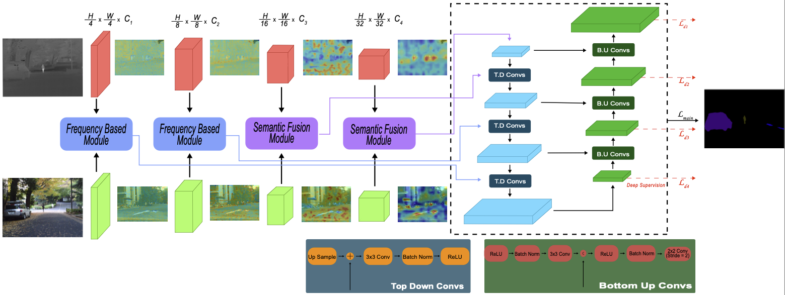

| Backbone | Dataset | MIoU | Weights |
|--------|----------|------|----------|
| ConvNextv2 Nano | MFNet | 0.6173 | [MFNet Nano FusionModel](https://drive.google.com/file/d/1pfUBBIdoftrjS2bSOIIG7l9krh6kBK9s/view?usp=sharing) |
| ConvNextv2 Tiny | MFNet | 0.6113 | [MFNet Tiny FusionModel](https://drive.google.com/file/d/1ofJGmORAXjlakvX1zn4un17El2XFJ2ci/view?usp=sharing) |
| ConvNextv2 Base | MFNet | 0.5963 | [MFNet Base FusionModel](https://drive.google.com/file/d/158K-qaOea3pfe-jZysQjrIfQIo1ANqla/view?usp=sharing) |
| ConvNextv2 Nano | PST900 | 0.8624 | [PST900 Nano FusionModel](https://drive.google.com/file/d/15TqSD6l5QTxtxLOwk4N9va36HhrTfGUo/view?usp=share_link) |
| ConvNextv2 Tiny | PST900 | 0.8788 | [PST900 Tiny FusionModel](https://drive.google.com/file/d/1ddY7EwZeEdfYRdfMom_vDzMR93ftpARc/view?usp=share_link) |
| ConvNextv2 Base | PST900 | 0.8848 | [PST900 Base FusionModel](https://drive.google.com/file/d/1D7SKkSe9vAIRUvi21ULCMR1HR1fHZ11q/view?usp=share_link) |
